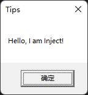
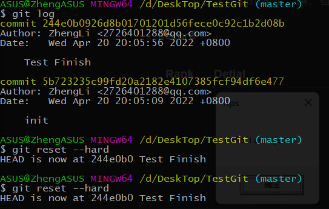
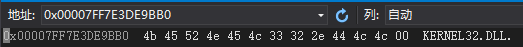
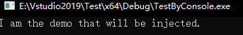
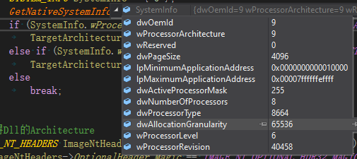

# DebugLog

## CAUSE

## TARGET

## PROCEDURE

### DebugOne

#### Questions

- [x] Dll的开发和使用
- [ ] 各个HASH_VALUE的值的生成过程和最终结果
- [x] 测试git的调试能力
- [ ] 64位的导出表的AddressOfFunctions中的地址是DWORD?
- [ ] ShellCode的原理

#### Guess

1. 第一次加载应该就会弹出Messagebox
2. 应该是大小写都可
3. 目标：要实现既可以迁出去测试还能再回到开发主线，且之后还能任意转到测试的状态；盲猜reset方式不能保留(已解决，对于测试项目创建Git)
4. 

#### Method

1. 生成dll，另外一个程序加载
2. 先右移HASH_KEY（13），只有等到最后调试的时候测，因为现在得到的值为十进制，当然可以在内存中获得其二进制数值，但是我仍不确定导出表中存储模块名的大小写
3. 按之前的想法走一遍，看log是否还有信息即能否转到相关的信息
4. 

#### Record

| Rank        | Detial                                                       | Info                                                         |
| ----------- | ------------------------------------------------------------ | ------------------------------------------------------------ |
|             |  | 测试成功，本程序自动加载模块，目标Dll 触发DLL_PROCESS_DETACH，弹出窗口。 |
|             |  | 说明$git reset --hard //是修改工作的内容与暂存区的内容一致，意思就是撤销刚才所有的修改，与上次add相比，改方法可以实现试探修改，只有commit了才会有log记录，也就是说，没有commit就没有log；所以要实现我的功能，（Test Start；Test Finish） |
|             | 得到的值为十进制 | `DWORD HashValue = MakeHashValue((char*)"KERNEL32");//.DLL 1848363543 -> 0x6E2BCA17  2360409275 -> 0x8CB0FCBB (Original 0x6A4ABC5B)` 其值并不一样 此处我猜到应为.的关系，该符号也减去了0x20（并没有好吧，.就是小于a 所以我也要重新测(此处测试，我是傻子)  此处测试失败，只能等到最后再来测试了，因为我也不知道为什么 |
| 4 ShellCode |                                                              |                                                              |

#### Review

#### Next

### DebugTwo Finish

#### Questions

- [x] 动态库最后的EntryPoint的调用用ShellCode，那么说明LoadLibrary中的调用EntryPoint的方式也是ShellCode?
- [ ] 测试是否运行成功，再测试注射器为64，目标进程是：加载器为32或者64
- [ ] 虚拟机无法运行Debug类型的程序，但是我现在先测Release版本
- [ ] 为什么Inject和Loader体系架构要一样？
- [x] 看看创建远程线程是否成功？返回ID了吗？
- [ ] CreateRemoteThread有问题？

#### Guess

1. 我猜是的
2. 如果成功会弹出"I am DllMain"
3. 需要配置
4. 我觉得不会

#### Method

1. 需要去查看LoadLibrary的源码(去分析Reactor的源码了，但是看不懂)
2. 放到虚拟机中去运行，先写两个32位和64位的小Demo
3. 去网上找配置方法
4. 用VS17测试

#### Record

| Rank                                                         | Detial                                                       | Info                                                         |
| ------------------------------------------------------------ | ------------------------------------------------------------ | ------------------------------------------------------------ |
|  | 任务管理器找到进程ID：4752                                   |                                                              |
|  |                                                              |                                                              |
|  | 得到系统信息                                                 | 注射器和加载器的体系架构应该一样，                           |
| 测试远程线程的创建                                           | 返回了ID，但是主进程还是崩了，我的ShellCode有问题？ShellCode的偏移有问题，EntryPoint设置本身就有问题？CreateRemoteThread有问题？ | 刚看了一下远程线程注入的情况，我觉得这个没问题，我怀疑是我其他部分存在问题，现在我先再检查一下其他部分 |
|                                                              | 不对，我刚才的状态有点混乱，我去看了远程线程注入，又看了一下shellcode注入，现在又想看用户层的调试（反正要解决这个bug，有点困难，目前确定就是在CreateRemoteThread中导致目标程序崩溃的) |                                                              |

#### Review

##### 第一次测试失败

被注入的程序意外中止？

#### Next

### Debug3

#### Questions

- [ ] 各个模块的HASH_VALUE
- [ ] 

#### Guess

#### Method

1. 

#### Record

| Rank | Detial | Info |
| ---- | ------ | ---- |
|      |        |      |

#### Review

#### Next
